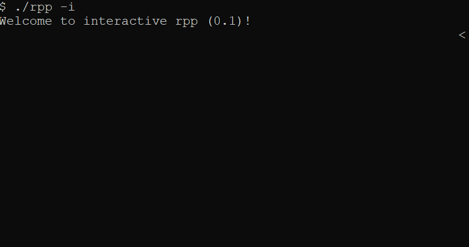

# Rashi Plus Plus (RPP) - The New Hebrew Scripting Language
[](https://github.com/daniel-shimon/rpp/releases/)


Interpreted, untyped, object-oriented and super cool.

<pre dir="rtl" align="right">
הדפס 'שלום עולם!'
</pre>

## Table of Contents

* [Compilation](#compile)
* [Variables, Comparison and Math](#vars)
    * [Operators](#vars-operators)
* [Control Flow](#flow)
    * [Keywords](#flow-keywords)
    * [Flexible Syntax](#flow-flexible)
* [Functions](#functions)
* [Classes](#classes)
    * [Magic Methods (dunders)](#classes-magic)
* [Exceptions](#exceptions)
    * [Exception types](#exceptions-types)
* [Built-Ins](#built-ins)
    * [List](#built-ins-list)
    * [Dictionary](#built-ins-dict)
    * [Range](#built-ins-range)
    * [Random](#built-ins-rand)
    * [I/O](#built-ins-io)
    * [Conversions and types](#built-ins-conv)
* [Patterns](#patterns)
    * [The Iterator pattern](#patterns-iter)

<a name="compile"/>

## Installation

The project depends on cmake and gcc (MinGW64 on windows).

##### A precompiled version for Windows x64 is available in the [release](https://github.com/daniel-shimon/rpp/releases/) section.

```bash
mkdir build
cd build
cmake ..
make
```

<a name="vars"/>

## Variables, comparison and math

<pre dir="rtl" align="right">
מ = 10
מ = מ / 100
הדפס מ // 0.1
מ = ((מ ** 2) * 300) % 40
הדפס מ // 3
הדפס מ שווהל 100 או 1 == 1 // true
הדפס מ גדולמ 70 וגם שקר // false
הדפס לא (מ קטןמ 0.34) // true
</pre>

<a name="vars-operators"/>

### Operators

Any of the c-style operators can be used interchangeably with the hebrew keywords

| c-style | rpp |
| :------ | --: |
| == | שווהל |
| != | שונהמ |
| > | גדולמ |
| < | קטןמ |
| >= | --- |
| <= | --- |
| ! | לא |
| / | חלקי |
| * | כפול |
| % | --- |
| - | --- |
| + | --- |

- Power operator: `**` (python-style)
- Boolean values: `אמת` and `שקר`
- Boolean operators: `או`, `וגם` and `לא`

<a name="flow"/>

## Control flow

<pre dir="rtl" align="right">
מ = 1

כלעוד מ קטןמ 10:
	אם מ שווהל 2:
		הדפס 'שתיים'
	אחרת אם מ % 2 == 0:
		הדפס 'זוגי'
	אחרת:
		הדפס 'אי-זוגי'
	מ = מ + 1

// אי-זוגי
// שתיים
// אי-זוגי
// זוגי
// ...

לכל מ בתוך טווח(100):
	הדפס מ

// 0, 1, 2, ...
</pre>

<a name="flow-keywords"/>

### Keywords

| c-style | rpp |
| :------ | --: |
| if | אם |
| else | אחרת |
| while | כלעוד |
| continue | המשך |
| break | שבור |

| python-style | rpp |
| :------ | --: |
| for | לכל |
| in | בתוך |

<a name="flow-flexible"/>

### Flexible syntax

All code blocks can be written in a one-line form or a multi-line indented block

<pre dir="rtl" align="right">
כלעוד אמת:
    הדפס 1

כלעוד אמת הדפס 1

אם שקר הדפס 1 אחרת אם אמת הדפס 2 אחרת:
    הדפס 3
// 2
</pre>

Supported code blocks:

- if, else if, else
- functions
- classes
- while loops
- for loops
- try, catch

<a name="functions"/>

## Functions

Functions in rpp are declared similarly to JavaScript - they can be declared by name or anonymously

<pre dir="rtl" align="right">
פיב = פעולה(מ):
	אם מ == 0 או מ == 1:
		החזר 1
	החזר פיב(מ - 1) + פיב(מ - 2)

הדפס_פיב = פעולה(מ) הדפס פיב(מ)

לכל מ בתוך טווח(5):
	הדפס_פיב(מ)

// 1, 1, 2, 3, 5, ...
</pre>

<a name="classes"/>

## Classes

Class declarations are declared similarly to functions (named or anonymous)

<pre dir="rtl" align="right">
מחלקה חישובים:
    פעולה כפל(א, ב):
        החזר א * ב

הדפס חישובים.כפל(4, 2)
// 8

חישובים2 = מחלקה:
    פעולה ריבוע(מ):
        החזר מ ** 2
        
הדפס חישובים2.ריבוע(3)
// 9
</pre>

<a name="classes-magic"/>

### Magic methods (dunders)

Similarly to Python, rpp classes can implement "magic" methods that run in certain situations

<pre dir="rtl" align="right">
מחלקה סניף:
    פעולה __התחל__(שם):
        אני.שם = שם
        אני.עובדים = רשימה()
    
    פעולה הוסף_עובד(שם_עובד):
        אני.עובדים.הוסף(שם_עובד)
    
    פעולה הסר_עובד_אחרון():
        אני.עובדים.הסר(אני.עובדים.גודל() - 1)
    
    פעולה __טקסט__():
        החזר אני.שם + ': ' + טקסט(אני.עובדים)

סניף_מרכזי = סניף('תל אביב')
סניף_מרכזי.הוסף_עובד('דניאל')

הדפס סניף_מרכזי

// תל אביב: [דניאל]
</pre>

| python-style | rpp |
| :----------- | --: |
| `__init__` | `__התחל__` |
| `__str__` | `__טקסט__` |
| `__getitem__` | `__קח__` |
| `__setitem__` | `__שים__` |
| `__next__` | `__הבא__` |
| `__iterator__` | `__איטרטור__` |

<a name="exceptions"/>

## Exceptions

Exceptions are thrown and caught by class type

| python-style | rpp |
| :------ | --: |
| try | נסה |
| catch | תפוס |
| as | בתור |
| throw | זרוק |

<pre dir="rtl" align="right">
נסה:
    ר = רשימה(1, 2)
    ר[23]
תפוס __שגיאת_מיקום__:
    הדפס 'שיט'

פעולה זורק():
    ערך = רשימה(1, 2)
    זרוק ערך

נסה:
    זורק()
תפוס רשימה בתור א:
    הדפס א
</pre>

<a name="exceptions-types"/>

### Exception types

- Index exception (thrown in list): `__שגיאת_מיקום__`
- Key exception (thrown in dictionary): `__שגיאת_מפתח__`
- Stop exception (thrown in iterator end): `__שגיאת_עצירה__`

<a name="built-ins"/>

## Built-ins

As all great programming languages, rpp is equipped with some useful built-ins

<a name="built-ins-list"/>

### List

<pre dir="rtl" align="right">
ר = רשימה(1,2,3)
ר[2] = אמת
הדפס ר.גודל() // 3
ר.הוסף('שלום')
ר.הוצא(0)
הדפס ר.מצא(אמת) // 2
הדפס ר.מצא('היי') // -1
הדפס ר // [אמת, 3, 'שלום']
לכל איבר בתוך ר:
    הדפס איבר
</pre>

<a name="built-ins-dict"/>

### Dictionary

Dictionaries in rpp support *only* string keys and any type of values

For looping a Dictionary will yield it's keys

<pre dir="rtl" align="right">
ר = מילון()
ר['שם'] = 'רשי ועוד ועוד'
ר['גרסה'] = '0.1'
הדפס ר.גודל() // 2
ר.הוצא('גרסה')
הדפס ר.מכיל('שם') // אמת
הדפס ר // {'שם': 'רשי ועוד ועוד'}
לכל מפתח בתוך ר:
    הדפס מפתח
// שם
</pre>

<a name="built-ins-range"/>

### Range

Similarly to Python, rpp has a built-in Range functionality, with two calling signatures:
- Iterate from 0 to max-1: `טווח(12)`
- Iterate from min to max-1: `טווח(10, 20)`

<pre dir="rtl" align="right">
לכל מ בתוך טווח(10) אם מ % 2 שווהל 0 הדפס "זוגי" אחרת הדפס "איזוגי"
// זוגי, איזוגי, ...
</pre>

<a name="built-ins-io"/>

### I/O

- Printing to console: the `הדפס` command.
- Receiving input from the user: the `(פלט)קלוט` function

Currently, Rashi Plus Plus supports hebrew I/O in the console!



(To enable hebrew in the windows console, please enable a TrueType font such as "Courier New")

<pre dir="rtl" align="right">
הדפס 'שלום'
הדפס 90
הדפס אמת
הדפס רשימה()

קלוט('>')
קלוט('מי אתה? ')
קלוט()
</pre>

<a name="built-ins-range"/>

### Range

Similarly to Python, rpp has a built-in Range functionality, with two calling signatures:
1. Iterate [0, max): `טווח(12)`
2. Iterate [min, max): `טווח(10, 20)`

<pre dir="rtl" align="right">
לכל מ בתוך טווח(10) אם מ % 2 שווהל 0 הדפס "זוגי" אחרת הדפס "איזוגי"
// זוגי, איזוגי, ...
</pre>

<a name="built-ins-rand"/>

### Random

Three random function signatures:
1. Random real number in range [0, 1): `()אקראי`
2. Random integer in range [0, max): `אקראי(3)`
3. Random integer in range [min, max): `אקראי(1000, 2000)`

<a name="built-ins-conv"/>

### Conversions and types

- String literals can be written with single (') or double (") quotes

<pre dir="rtl" align="right">
הדפס "המספר הוא " + טקסט(34) // המספר הוא 34
הדפס מספר("3") * 2 // 6
הדפס סוג(אמת) // <bool>
</pre>

<a name="patterns"/>

## Patterns

<a name="patterns-iter"/>

### The Iterator pattern

To implement an Iterator in rpp, a class must implement the following:

- Return the iterator: `__איטרטור__()`
- Return the next value and throw `__שגיאת_עצירה__` on end: `__הבא__()`

<pre dir="rtl" align="right">
מחלקה קומבינציות:
    פעולה __התחל__(רשימה_א, רשימה_ב):
        אני.רשימה_א = רשימה_א
        אני.רשימה_ב = רשימה_ב
    פעולה __איטרטור__():
        אני.א = 0
        אני.ב = -1
        החזר אני
    פעולה __הבא__():
		אני.ב = אני.ב + 1
        
		אם אני.ב שווהל אני.רשימה_ב.גודל():
            אני.ב = 0
            אני.א = אני.א + 1
		
        אם אני.א שווהל אני.רשימה_א.גודל():
            זרוק __שגיאת_עצירה__()
        החזר אני.רשימה_א[אני.א] + ' ' + אני.רשימה_ב[אני.ב]

שמות = קומבינציות(רשימה('דניאל', 'דני', 'רון'), רשימה('שמעון', 'בכר'))

לכל שם בתוך שמות:
    הדפס שם
</pre>
